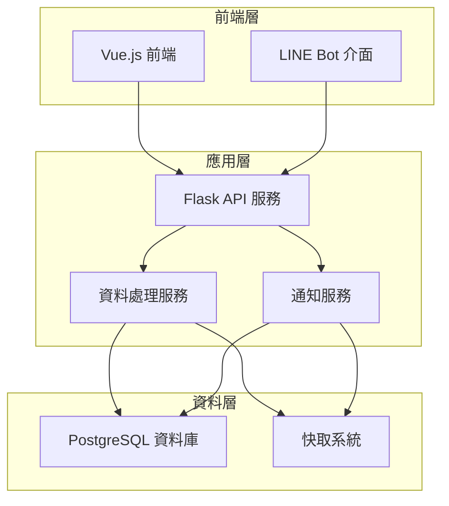
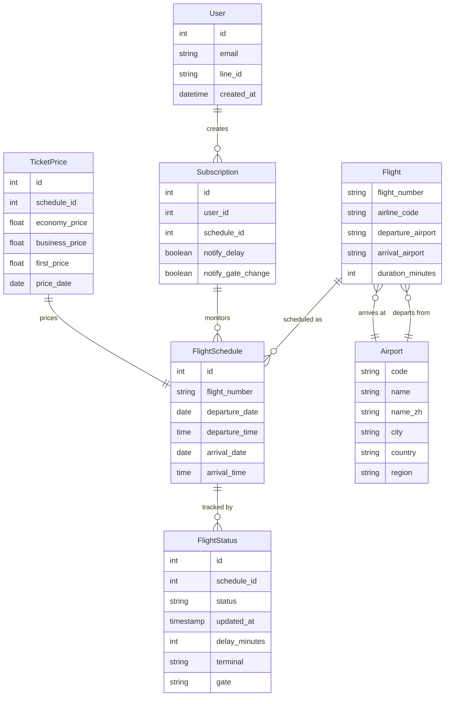
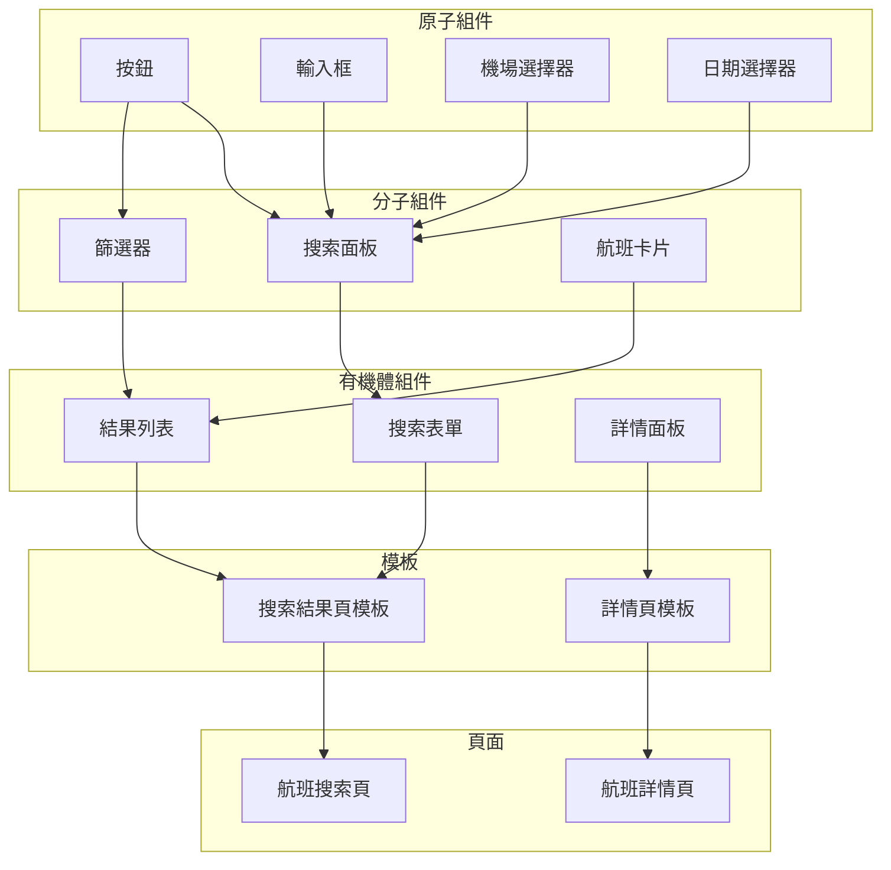
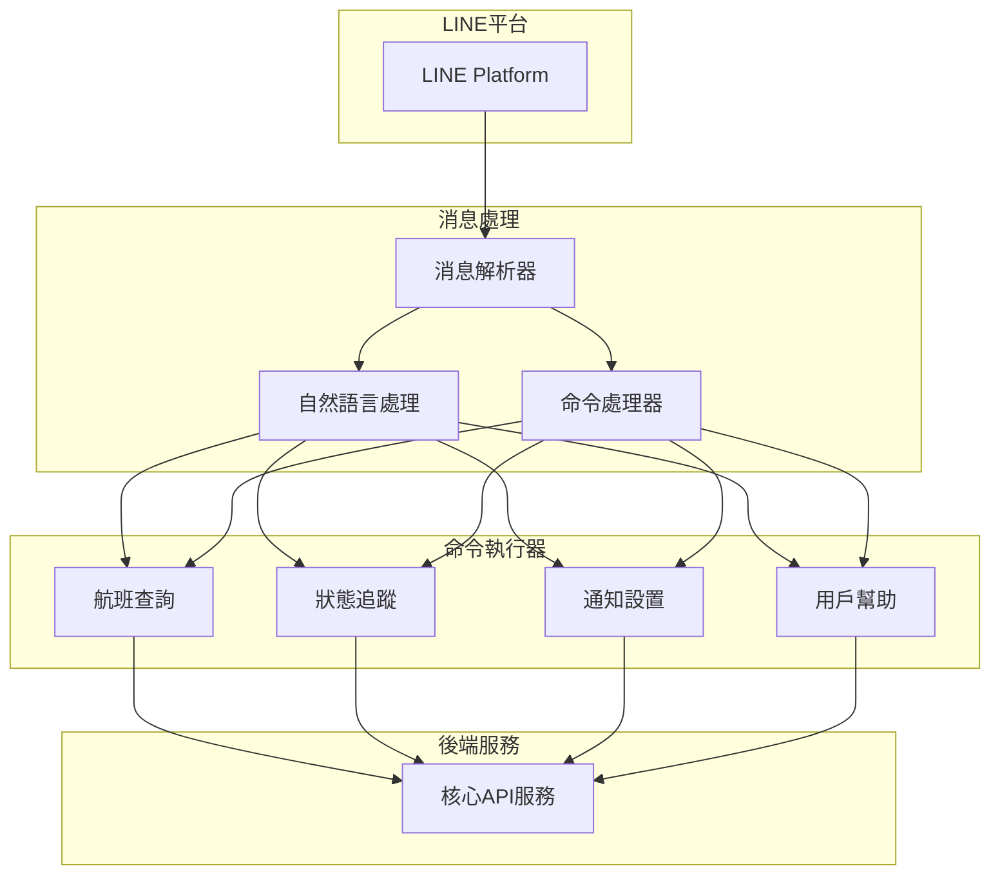
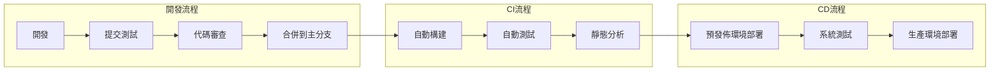

# 臺灣航班整合系統 - 系統架構與設計模式

## 整體系統架構

### 架構概覽

臺灣航班整合系統採用現代化的三層分離架構，確保系統各部分的獨立性和可擴展性：



這種架構實現了關注點分離，各層獨立開發和擴展，同時確保系統穩定性和性能。

### 核心組件關係

系統的主要組件與其職責：

1. **前端應用 (Vue.js)**: 
   * 負責與用戶直接交互的網頁界面
   * 通過API調用與後端服務交互
   * 實現響應式設計，適配不同設備

2. **LINE Bot**:
   * 提供基於LINE平台的用戶交互
   * 解析自然語言命令並調用API服務
   * 發送通知和實時更新

3. **API服務 (Flask)**:
   * 統一處理前端和LINE Bot的請求
   * 實現業務邏輯和資料轉換
   * 協調各類服務和資源

4. **資料處理服務**:
   * 同步和整合來自多個源的航班數據
   * 實現資料清洗和標準化
   * 執行資料分析和預測模型

5. **通知服務**:
   * 管理用戶訂閱和通知偏好
   * 監控航班狀態變更
   * 通過LINE和網頁推送通知

6. **資料庫 (PostgreSQL)**:
   * 存儲航班、用戶和系統數據
   * 提供查詢和資料持久化服務
   * 確保資料完整性和一致性

7. **快取系統**:
   * 提高頻繁訪問數據的響應速度
   * 減輕數據庫負載
   * 實現數據臨時存儲和過期管理

## 技術決策與設計模式

### 關鍵技術選擇

| 技術/組件 | 選擇 | 決策理由 |
|----------|-----|---------|
| 前端框架 | Vue.js 3 | 輕量級、易於學習、響應式開發、良好的生態系統 |
| CSS框架 | Tailwind CSS | 高度可定制、原子化設計、快速開發 |
| 後端框架 | Flask | 靈活、輕量、易於擴展、Python生態系統優勢 |
| ORM | SQLAlchemy | 強大的ORM功能、多數據庫支持、Python社區標準 |
| 資料庫 | PostgreSQL (Neon) | 強大的關係型數據庫能力、雲託管、性能優越 |
| API設計 | RESTful API | 標準化、可預測、易於文檔化、廣泛支持 |
| 通訊工具 | LINE Messaging API | 台灣用戶高滲透率、完善的API文檔、豐富的消息類型 |
| 部署 | Render (後端)、Vercel (前端) | 現代化雲平台、CI/CD整合、易於配置 |

### 設計模式應用

系統採用多種設計模式解決特定問題，提高代碼質量和可維護性：

#### 1. 倉儲模式 (Repository Pattern)

應用於資料訪問層，將數據存儲邏輯與業務邏輯分離：

```python
# 示例代碼 - 倉儲模式
class FlightRepository:
    def __init__(self, db_session):
        self.db_session = db_session
    
    def get_flights_by_route(self, departure, arrival, date):
        return self.db_session.query(Flight).filter(
            Flight.departure_airport == departure,
            Flight.arrival_airport == arrival,
            Flight.departure_date == date
        ).all()
    
    # 其他數據訪問方法...
```

**優勢**:
- 隔離數據訪問邏輯
- 可替換的數據源
- 便於單元測試
- 統一的數據訪問接口

#### 2. 服務層模式 (Service Layer)

業務邏輯集中在專門的服務類中，協調各種操作和資源：

```python
# 示例代碼 - 服務層模式
class FlightService:
    def __init__(self, flight_repo, flight_stats_client, tdx_client):
        self.flight_repo = flight_repo
        self.flight_stats_client = flight_stats_client
        self.tdx_client = tdx_client
    
    def find_best_flights(self, departure, arrival, date, sort_by='price'):
        # 從多個數據源獲取數據
        local_flights = self.flight_repo.get_flights_by_route(departure, arrival, date)
        tdx_flights = self.tdx_client.get_flights(departure, arrival, date)
        
        # 整合數據
        combined_flights = self._merge_flight_data(local_flights, tdx_flights)
        
        # 業務邏輯：排序和篩選
        if sort_by == 'price':
            return sorted(combined_flights, key=lambda x: x.price)
        elif sort_by == 'duration':
            return sorted(combined_flights, key=lambda x: x.duration)
            
        return combined_flights
```

**優勢**:
- 業務邏輯集中管理
- 提高代碼重用性
- 關注點分離
- 便於單元測試

#### 3. 工廠模式 (Factory Pattern)

用於建立客戶端或複雜對象實例，隱藏實例化邏輯：

```python
# 示例代碼 - 工廠模式
class APIClientFactory:
    @staticmethod
    def create_tdx_client(config):
        return TDXClient(config.get('tdx_api_key'), config.get('tdx_api_secret'))
    
    @staticmethod
    def create_flight_stats_client(config):
        return FlightStatsClient(
            config.get('fs_app_id'), 
            config.get('fs_app_key')
        )
```

**優勢**:
- 對象創建邏輯集中
- 客戶端代碼與具體類解耦
- 便於擴展和維護

#### 4. 策略模式 (Strategy Pattern)

用於實現不同的數據同步和處理策略：

```python
# 示例代碼 - 策略模式
class SyncStrategy:
    def sync_data(self, source, destination):
        pass

class FullSyncStrategy(SyncStrategy):
    def sync_data(self, source, destination):
        # 實現全量同步邏輯
        data = source.get_all_data()
        destination.clear()
        destination.save_batch(data)

class IncrementalSyncStrategy(SyncStrategy):
    def sync_data(self, source, destination):
        # 實現增量同步邏輯
        last_sync = destination.get_last_sync_time()
        new_data = source.get_data_since(last_sync)
        destination.update_batch(new_data)

class DataSyncService:
    def __init__(self, strategy):
        self.strategy = strategy
    
    def set_strategy(self, strategy):
        self.strategy = strategy
    
    def execute_sync(self, source, destination):
        self.strategy.sync_data(source, destination)
```

**優勢**:
- 在運行時切換算法
- 封裝各種同步策略
- 可擴展的設計

#### 5. 觀察者模式 (Observer Pattern)

用於通知系統，監聽航班狀態變更並通知相關用戶：

```python
# 示例代碼 - 觀察者模式
class FlightSubject:
    def __init__(self):
        self._observers = []
    
    def attach(self, observer):
        self._observers.append(observer)
    
    def detach(self, observer):
        self._observers.remove(observer)
    
    def notify(self, flight_id, status, update_time):
        for observer in self._observers:
            observer.update(flight_id, status, update_time)

class LineNotificationObserver:
    def __init__(self, line_service):
        self.line_service = line_service
    
    def update(self, flight_id, status, update_time):
        # 獲取關注該航班的用戶
        users = self.get_subscribed_users(flight_id)
        
        # 發送LINE通知
        for user in users:
            self.line_service.send_flight_update(
                user.line_id, 
                flight_id, 
                status, 
                update_time
            )
```

**優勢**:
- 事件驅動架構
- 鬆散耦合
- 易於擴展新的通知方式

## 數據模型設計

### 核心數據實體

主要實體及其關係形成系統的數據基礎：



### 數據同步策略

系統通過多層策略確保數據的及時性和准確性：

1. **定期同步**:
   * 每日全量同步基礎航班數據
   * 每3小時同步航班狀態
   * 每週同步機場信息

2. **增量更新**:
   * 重點航線和時間段每30分鐘更新狀態
   * 根據變更頻率自適應調整同步間隔

3. **多源整合**:
   * TDX API作為主要數據源
   * FlightStats補充國際航班信息
   * 航空公司官方API作為補充來源

4. **衝突解決策略**:
   * 基於時間戳的最新數據優先
   * 特定情況下的來源優先級排序
   * 異常值檢測和修正

## API設計原則

系統API設計遵循以下原則：

### RESTful API設計

1. **資源導向**:
   * 使用名詞表示資源 (如 `/flights`, `/airports`)
   * 適當使用子資源表示關係 (如 `/flights/{id}/status`)

2. **HTTP方法使用**:
   * GET: 獲取資源
   * POST: 創建資源
   * PUT: 完全更新資源
   * PATCH: 部分更新資源
   * DELETE: 刪除資源

3. **URL結構**:
   * 使用複數名詞 (如 `/flights` 而非 `/flight`)
   * 使用查詢參數進行過濾 (如 `/flights?from=TPE&to=HKG`)
   * 支持分頁 (如 `/flights?page=2&limit=20`)

4. **回應格式**:
   * 統一的JSON響應結構
   * 適當的HTTP狀態碼使用
   * 錯誤處理統一格式

### API端點示例

```
# 航班搜索
GET /api/flights?from={airport_code}&to={airport_code}&date={yyyy-mm-dd}

# 航班詳情
GET /api/flights/{flight_id}

# 航班狀態
GET /api/flights/{flight_id}/status

# 機場列表
GET /api/airports?region={region_code}

# 機場詳情
GET /api/airports/{airport_code}

# 用戶訂閱
POST /api/subscriptions
DELETE /api/subscriptions/{subscription_id}

# 票價查詢
GET /api/prices?flight_id={flight_id}&date={yyyy-mm-dd}
```

## 前端架構

### 組件設計

前端組件結構採用原子設計方法論，從小到大分為以下級別：

1. **原子組件** (Atoms): 
   * 最基本的UI元素
   * 按鈕、輸入框、標籤、圖標等
   * 高度可複用且與業務邏輯無關

2. **分子組件** (Molecules): 
   * 由多個原子組件組合而成
   * 搜索框、表單控件、卡片元素等
   * 實現特定的UI功能

3. **有機體組件** (Organisms): 
   * 由分子組件和原子組件組成
   * 航班卡片、搜索表單、篩選面板等
   * 包含特定業務邏輯

4. **模板** (Templates): 
   * 頁面級別的容器
   * 定義組件的排列和布局
   * 可複用於多個頁面

5. **頁面** (Pages): 
   * 實際的應用頁面
   * 結合模板和具體數據
   * 處理頁面級業務邏輯和狀態



### 狀態管理

使用Pinia實現前端狀態管理，主要模塊包括：

1. **航班搜索模塊**:
   * 管理搜索條件和參數
   * 存儲搜索結果
   * 處理篩選和排序邏輯

2. **用戶模塊**:
   * 管理用戶登錄狀態
   * 保存用戶偏好設置
   * 處理授權和認證

3. **通知模塊**:
   * 管理系統通知和提醒
   * 處理推送訂閱
   * 顯示即時更新

4. **UI狀態模塊**:
   * 管理全局UI狀態
   * 處理主題和顯示偏好
   * 控制加載狀態和錯誤顯示

## LINE Bot架構

LINE Bot服務通過命令處理器模式實現各種功能：



### 命令處理流程

1. **接收消息**:
   * LINE平台轉發用戶消息到Webhook
   * 系統驗證消息來源和安全性

2. **消息解析**:
   * 識別消息類型（文本、圖片、位置等）
   * 提取關鍵參數和指令

3. **命令執行**:
   * 路由到對應的命令處理器
   * 執行業務邏輯並準備回應

4. **回應形成**:
   * 建立適合的回應格式（文本、卡片、菜單等）
   * 添加互動元素和連接

5. **發送回應**:
   * 通過LINE Messaging API返回消息
   * 處理發送確認和錯誤

### LINE Bot命令設計

| 命令類型 | 示例指令 | 處理邏輯 |
|---------|---------|---------|
| 航班搜索 | `搜尋 台北 東京 6/20` | 解析出發地、目的地和日期，調用搜索API |
| 航班狀態 | `CI501 狀態` | 解析航班號，查詢最新狀態 |
| 機場資訊 | `機場 TPE` | 提供指定機場的信息和當前運行狀況 |
| 延誤提醒 | `追蹤 CI501 6/15` | 設置對特定航班的狀態通知 |
| 航班推薦 | `推薦 台北 曼谷 七月` | 分析並推薦最佳航班選擇 |
| 票價提醒 | `票價 台北 東京 < 8000` | 設置價格降至特定水平的提醒 |
| 幫助指令 | `幫助` `說明` | 提供指令列表和使用示例 |

## 快取策略與性能優化

系統採用多層快取策略提高性能和響應速度：

### 1. 應用層快取

使用記憶體內快取存儲頻繁訪問的數據：

```python
# 示例代碼 - 應用層快取
from functools import lru_cache

class FlightDataService:
    @lru_cache(maxsize=100)
    def get_airport_by_code(self, code):
        # 數據庫查詢
        return self.airport_repository.find_by_code(code)
    
    @lru_cache(maxsize=50)
    def get_popular_routes(self):
        # 計算密集型操作
        return self.analytics_service.calculate_popular_routes()
```

### 2. API響應快取

對API響應進行快取，減少重複計算：

```python
# 示例代碼 - API響應快取
from flask_caching import Cache

cache = Cache(app, config={'CACHE_TYPE': 'SimpleCache'})

@app.route('/api/airports')
@cache.cached(timeout=3600)  # 快取1小時
def get_airports():
    airports = airport_service.get_all_airports()
    return jsonify(airports)

@app.route('/api/flights')
@cache.memoize(timeout=300)  # 快取5分鐘
def search_flights():
    # 基於查詢參數的快取
    from_airport = request.args.get('from')
    to_airport = request.args.get('to')
    date = request.args.get('date')
    
    flights = flight_service.search_flights(from_airport, to_airport, date)
    return jsonify(flights)
```

### 3. 數據庫查詢優化

通過索引和查詢優化提高數據庫性能：

1. **主要索引**:
   * 航班編號和日期組合索引
   * 出發和到達機場聯合索引
   * 狀態更新時間索引

2. **查詢優化技巧**:
   * 使用延遲加載避免大量連接
   * 分頁查詢大結果集
   * 選擇性加載關聯數據

3. **數據分區**:
   * 按日期對航班數據進行分區
   * 針對歷史數據的冷熱分離
   * 定期數據歸檔策略

## 錯誤處理與日誌記錄

### 集中式錯誤處理

系統實現統一的錯誤處理機制：

```python
# 示例代碼 - 錯誤處理
class APIError(Exception):
    def __init__(self, status_code, message, code=None):
        self.status_code = status_code
        self.message = message
        self.code = code
        super().__init__(self.message)

# 全局錯誤處理
@app.errorhandler(APIError)
def handle_api_error(error):
    response = {
        'error': True,
        'message': error.message,
        'code': error.code
    }
    return jsonify(response), error.status_code

# 使用示例
@app.route('/api/flights/<id>')
def get_flight(id):
    flight = flight_service.get_flight_by_id(id)
    if not flight:
        raise APIError(404, "找不到該航班信息", "FLIGHT_NOT_FOUND")
    return jsonify(flight)
```

### 結構化日誌

採用結構化日誌格式便於分析和監控：

```python
# 示例代碼 - 結構化日誌
import logging
import json
import time

class StructuredLogger:
    def __init__(self, name):
        self.logger = logging.getLogger(name)
        self.logger.setLevel(logging.INFO)
        
        handler = logging.StreamHandler()
        self.logger.addHandler(handler)
    
    def log(self, level, message, **kwargs):
        # 添加標準字段
        log_data = {
            'timestamp': time.time(),
            'level': level,
            'message': message,
            **kwargs
        }
        
        log_entry = json.dumps(log_data)
        
        if level == 'ERROR':
            self.logger.error(log_entry)
        elif level == 'WARNING':
            self.logger.warning(log_entry)
        else:
            self.logger.info(log_entry)
    
    def info(self, message, **kwargs):
        self.log('INFO', message, **kwargs)
    
    def warn(self, message, **kwargs):
        self.log('WARNING', message, **kwargs)
    
    def error(self, message, **kwargs):
        self.log('ERROR', message, **kwargs)

# 使用示例
logger = StructuredLogger('flight_service')
logger.info("航班搜索完成", count=15, duration_ms=120, search_params={
    'from': 'TPE',
    'to': 'HKG',
    'date': '2023-06-15'
})
```

## 持續部署與維護

### CI/CD流程

系統使用現代CI/CD實踐自動化部署過程：



### 監控與告警

系統採用多層監控策略確保穩定運行：

1. **應用監控**:
   * API響應時間跟蹤
   * 錯誤率和異常監控
   * 關鍵業務流程檢測

2. **系統監控**:
   * 資源使用率 (CPU, 內存, 磁盤)
   * 網絡流量和延遲
   * 數據庫性能指標

3. **業務監控**:
   * 用戶活動和參與度
   * 搜索成功率和轉換率
   * 通知發送成功率

4. **告警策略**:
   * 基於閾值的多級告警
   * 基於趨勢的預警
   * 異常檢測和告警

## 安全策略

系統實施全面的安全措施保護用戶數據和系統完整性：

### 1. API安全

* **認證**: 基於JWT的API認證機制
* **速率限制**: 防止API濫用的請求限制
* **輸入驗證**: 全面的請求參數驗證
* **CORS策略**: 嚴格的跨域資源共享配置

### 2. 數據安全

* **敏感數據加密**: 用戶密碼和個人信息加密存儲
* **傳輸加密**: 全站HTTPS/TLS保護
* **數據備份**: 定時自動備份和災難恢復計劃
* **資料最小化**: 僅收集必要的用戶數據

### 3. 基礎設施安全

* **環境隔離**: 開發、測試和生產環境嚴格分離
* **最小權限原則**: 服務和用戶僅擁有必要權限
* **依賴管理**: 定期更新和審計第三方依賴
* **安全掃描**: 定期進行代碼和依賴安全掃描

_最後更新：2025年5月09日_ 